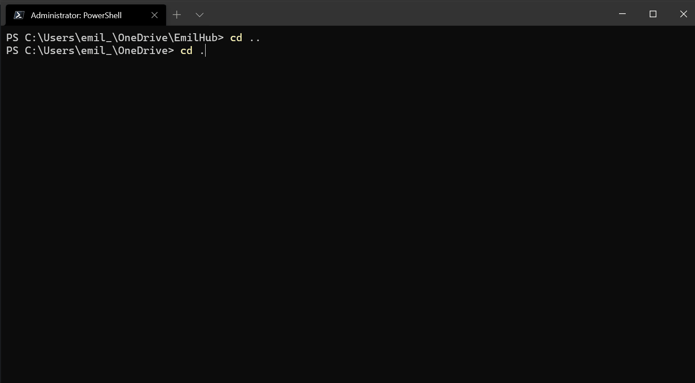

# PSHangMan
1. Install the module
```powershell
Install-Module -Name 'PSHangMan' -Repository PSGallery
```
2. run: 
```powershell
Import-Module 'PSHangMan'; New-HangManGame
```
3. Have fun!

PS, If you think there's not enough secrets, don't get upset - add more or add an issue or PR to the repo with suggestions!
  

